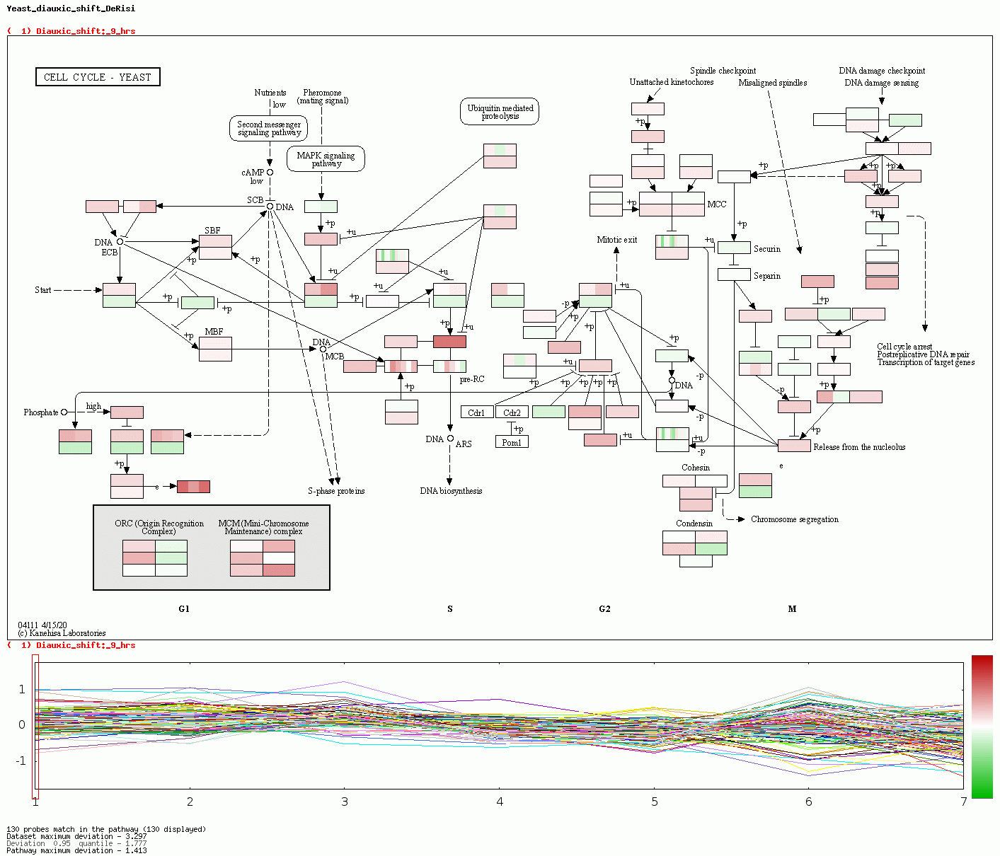

## Project Description

KEGG Metabolic pathways can be realized into different networks. Two kinds of network / graph can be formed. These include the Reaction Network and Relation Network. In the Reaction network, Substrate or Product compounds are considered as Nodes, while genes are treated as Edges. In the Relation network, however, Substrate and Product componds are considered as Edges while enzymes and genes are placed as Nodes. A large number of metabolic pathways was tooled from KEGG XML. They were modeled into the metabolic graphs as described above. With the help of the Cytoscape tool, a variety of network features were computed.

This project focuses on modelling the KEGG metabolic pathway on the Reaction network.

## Demo

## Features

Attribute Information:

- a) Pathway text
- b) Connected Components Integer (min:1, max:39 )
- c) Diameter Integer (min:1, max:46 )
- d) Radius Integer (min:1, max:13 )
- e) Centralization Integer (min:0, max:1 )
- f) Shortest Path Integer (min:2, max:23420 )
- g) Characteristic Path Length Integer (min:1)
- h) Avg.num.Neighbours real
- i) Density real (max:1)
- j) Heterogeneity real (min:0)
- k) Isolated Nodes Integer (min:0, max:3)
- l) Number of Self Loops Integer (min:0, max:4)
- m) Multi-edge Node Pair Integer (min:0, max:220)
- n) NeighborhoodConnectivity real
- o) NumberOfDirectedEdges real)
- p) Stress real (min:0)
- q) SelfLoops real (min:0)
- r) Partner Of MultiEdged NodePairs Integer (min:0, max:3)
- s) Degree real (min:1)
- t) TopologicalCoefficient real (min:0, max:1)
- u) BetweennessCentrality real (min:0)
- v) Radiality real (max:30744573457 )
- w) Eccentricity real
- x) NumberOfUndirectedEdges real (min:0)
- y) ClosenessCentrality real (max:1)
- z) AverageShortestPathLength real
- aa) ClusteringCoefficient real (min:0, max:1)
- bb) nodeCount Integer (min:2, max:232)
- cc) edgeCount Integer (min:1, max:444)

  
## Appendix

Data Source:
1. Dua, D. and Graff, C. (2019). UCI Machine Learning Repository [http://archive.ics.uci.edu/ml]. Irvine, CA: University of California, School of Information and Computer Science.

## Authors

1. Muhammad Naeem, Centre of Research in Data Engineering (CORDE) & Department of Computer Science, MAJU Islamabad Pakistan (naeems.naeem@gmail.com).
2. Sohail Asghar, Director/Associate Professor University Institute of IT PMAS-Arid Agriculture University,Rawalpindi Pakistan, Centre of Research in Data Engineering (CORDE),(sohail.asghar@gmail.com)

## Citation
1. Naeem M., Asghar S., Centre of Research in Data Engineering Islamabad Pakistan, naeems.naeem@gmail.com, sohail.asg@gmail.com
