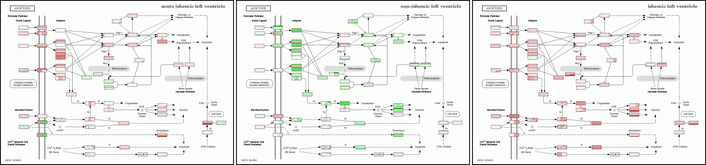

## Project Description

KEGG Metabolic pathways can be realized into network. Two kinds of network / graph can be formed. These include Reaction Network and Relation Network. In Reaction network, Substrate or Product compound are considered as Node and genes are treated as edge. Whereas in the relation network, Substrate and Product componds are considered as Edges while enzyme and genes are placed as nodes. We tool large number of metabolic pathways from KEGG XML. They were modeled into the graph as described above. With the help of Cytoscape tool, variety of network features were compunted.

## Demo

 / ! 

https://biit.cs.ut.ee/KEGGanim/images/KEGGanim_figure_ishemia.gif

https://biit.cs.ut.ee/KEGGanim/img/Kwp54/04111.gif?0.386570969166907

## Features

Attribute Information:

- a) Pathway text
- b) Connected Components Integer (min:1, max:39 )
- c) Diameter Integer (min:1, max:46 )
- d) Radius Integer (min:1, max:13 )
- e) Centralization Integer (min:0, max:1 )
- f) Shortest Path Integer (min:2, max:23420 )
- g) Characteristic Path Length Integer (min:1)
- h) Avg.num.Neighbours real
- i) Density real (max:1)
- j) Heterogeneity real (min:0)
- k) Isolated Nodes Integer (min:0, max:3)
- l) Number of Self Loops Integer (min:0, max:4)
- m) Multi-edge Node Pair Integer (min:0, max:220)
- n) NeighborhoodConnectivity real
- o) NumberOfDirectedEdges real)
- p) Stress real (min:0)
- q) SelfLoops real (min:0)
- r) Partner Of MultiEdged NodePairs Integer (min:0, max:3)
- s) Degree real (min:1)
- t) TopologicalCoefficient real (min:0, max:1)
- u) BetweennessCentrality real (min:0)
- v) Radiality real (max:30744573457 )
- w) Eccentricity real
- x) NumberOfUndirectedEdges real (min:0)
- y) ClosenessCentrality real (max:1)
- z) AverageShortestPathLength real
- aa) ClusteringCoefficient real (min:0, max:1)
- bb) nodeCount Integer (min:2, max:232)
- cc) edgeCount Integer (min:1, max:444)

  
## Appendix

Data Source:

KEGG Metabolic pathways can be realized into network. Two kinds of network / graph can be formed. These include Reaction Network and Relation Network. In Reaction network, Substrate or Product compound are considered as Node and genes are treated as edge. Whereas in the relation network, Substrate and Product componds are considered as Edges while enzyme and genes are placed as nodes. We tool large number of metabolic pathways from KEGG XML. They were modeled into the graph as described above. With the help of Cytoscape tool, variety of network features were compunted.
## Authors

1. Muhammad Naeem, Centre of Research in Data Engineering (CORDE) & Department of Computer Science, MAJU Islamabad Pakistan (naeems.naeem@gmail.com).
2. Sohail Asghar, Director/Associate Professor University Institute of IT PMAS-Arid Agriculture University,Rawalpindi Pakistan, Centre of Research in Data Engineering (CORDE),(sohail.asghar@gmail.com)

## Citation
1. Naeem M,Asghar S, Centre of Research in Data Engineering Islamabad Pakistan, naeems.naeem@gmail.com, sohail.asg@gmail.com
